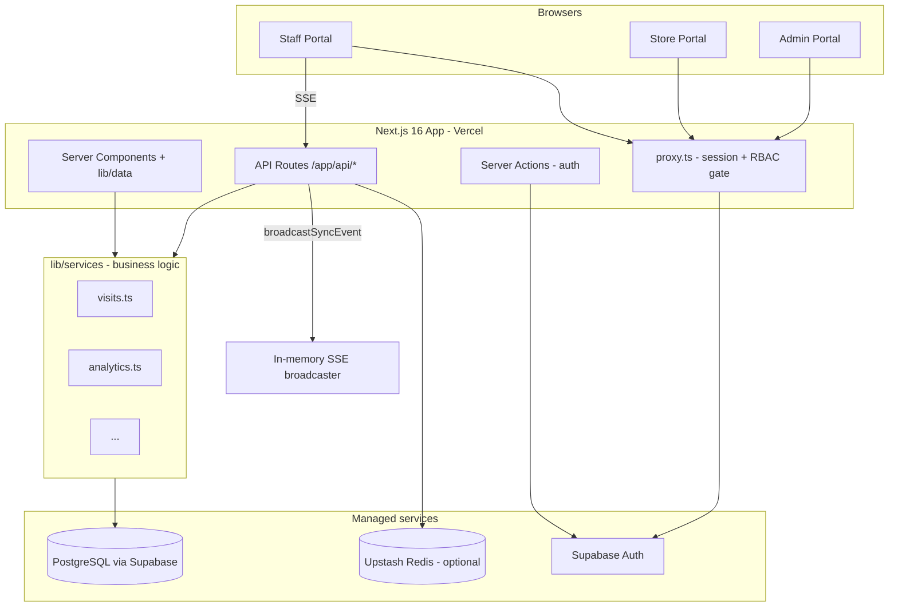
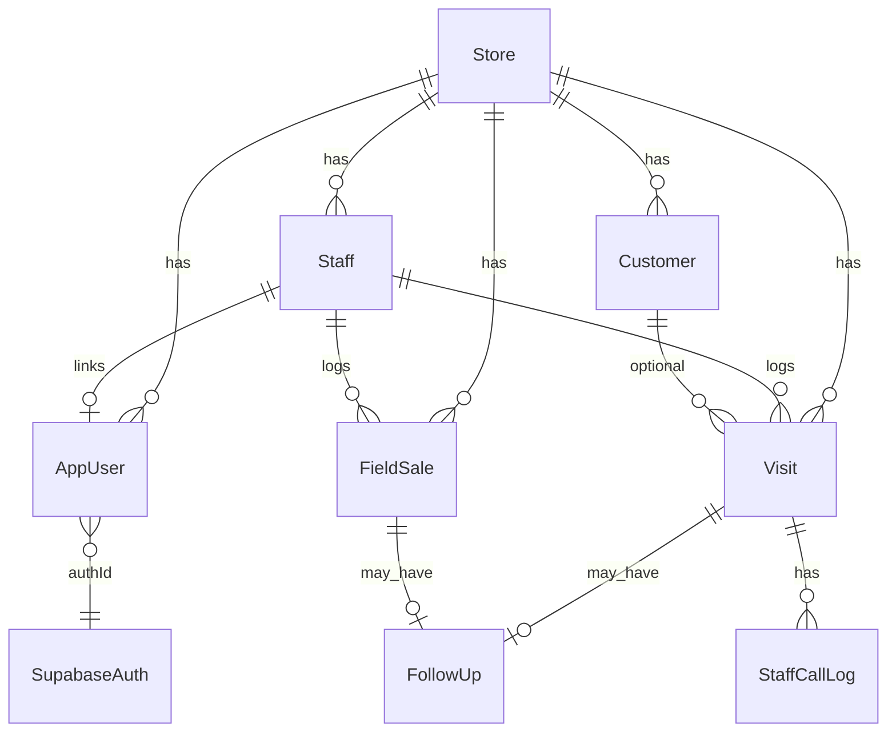
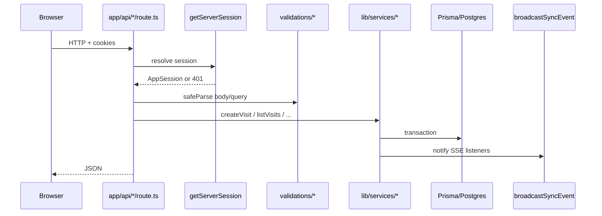

# FineSet — Full Architecture Guide

**Purpose:** This document explains what FineSet is, what we built, how frontend/backend/database work together, and **why** each decision was made. Use it to walk a senior backend engineer through the system and answer follow-up questions.

---

## 1. What is FineSet?

FineSet is a **multi-tenant SaaS** for jewelry store chains (and similar retail). One deployment serves many stores. Three separate **portals** exist:

| Portal | URL prefix | Who uses it | Main jobs |
|--------|------------|-------------|-----------|
| **Staff** | `/staff/dashboard` | Floor sales staff (RSO) | Log store visits, field sales, follow-up calls |
| **Store Manager** | `/store-manager/dashboard` | Per-store managers | Log visits/calls/field sales, store analytics |
| **Business Owner** | `/business-owner/dashboard` | Chain owners | Multi-store portfolio, visits, staff, analytics |
| **Admin** | `/admin/dashboard` | Master admin (HQ) | All stores, invite users, chain-wide analytics |

**Business domains we model:**

- **Visits** — customer walk-ins at a store (purchase intent, schemes pitched, follow-ups).
- **Field sales** — off-store activities (door-to-door, events, etc.).
- **Customers** — deduplicated per store by phone hash; PII encrypted at rest.
- **Follow-ups** — tasks linked to a visit or field sale.
- **Staff calls** — call outcomes on follow-up queue items.
- **Analytics** — KPIs and RSO (staff) performance by period.

---

## 2. High-level system diagram



**Key idea:** We use **one Next.js codebase** for UI and API. There is no separate Express/FastAPI server. “Backend” = API route handlers + `lib/services/*` + Prisma.

---

## 3. Tech stack — what we use and why

| Layer | Technology | Why we chose it |
|-------|------------|-----------------|
| Framework | **Next.js 16** (App Router) | Single repo for SSR dashboards + REST API; good Vercel deployment story |
| Language | **TypeScript (strict)** | Shared types between API, services, and UI |
| UI | **React 18**, **Tailwind**, **shadcn/Radix** | Fast dashboards, accessible primitives |
| ORM | **Prisma 6** | Type-safe DB access, migrations, seed scripts |
| Database | **PostgreSQL** on **Supabase** | Managed Postgres + connection pooler for serverless |
| Auth | **Supabase Auth** (email/password + invite) | Passwords and sessions outsourced; we keep app roles in our DB |
| Client state | **TanStack React Query v5** | Caching, mutations, SSR `initialData` hydration |
| Validation | **Zod** | Same schemas for API body/query and forms |
| Forms | **react-hook-form** + `@hookform/resolvers` | Complex visit/field-sale forms |
| Charts | **Recharts** (lazy-loaded) | Store/admin analytics |
| Realtime | **SSE** (`/api/sync/events`) | Invalidate caches when another user changes data; simpler than WebSockets for read-heavy dashboards |
| Rate limit | **Upstash Redis** + `@upstash/ratelimit` | Login, writes, SSE; gracefully disabled locally if env vars missing |
| PII | **AES-256-GCM** (`ENCRYPTION_KEY`) | Encrypt customer name/phone in DB; SHA-256 hash for lookup/dedup |
| Tests | **Vitest**, **Playwright**, **MSW** | Unit/integration/E2E |

---

## 4. Repository layout (mental map)

```
app/                    # Routes (pages + API)
  (staff)/              # Staff portal pages
  (store)/              # Store manager portal
  (admin)/              # Master admin portal
  (auth)/               # Login pages
  api/                  # REST handlers → lib/services
  auth/callback/        # Supabase OAuth/invite callback

components/             # UI (forms, tables, charts, layout)
hooks/                  # React Query hooks (useVisits, useAnalytics, …)
lib/
  services/             # ★ Business logic + Prisma (shared by API + RSC)
  data/                 # Server-only fetchInitial* for SSR
  api/                  # Browser fetch() wrappers to /api/*
  auth/                 # Session, invites, RBAC, sign-in action
  validations/          # Zod schemas
  sync/                 # SSE broadcaster + invalidation helpers
  crypto/               # PII encrypt/decrypt/hash
  supabase/             # SSR/browser/admin Supabase clients
prisma/
  schema.prisma         # Data model
  migrations/           # SQL migrations
  seed.ts               # Demo stores, staff, visits
content/en.ts           # All user-visible strings (i18n-ready)
proxy.ts                # Edge middleware (session refresh + portal RBAC)
```

**Rule for backend engineers:** Put **all DB logic** in `lib/services/*`. API routes should be thin: auth → validate → call service → JSON.

---

## 5. Database architecture

### 5.1 Connection strategy

- **`DATABASE_URL`** — Supabase **transaction pooler** (`:6543`, `pgbouncer=true`) for app runtime (API + RSC).
- **`DIRECT_URL`** — Direct Postgres (`:5432`) for **Prisma migrations only**.

**Why:** Serverless Next.js opens many short-lived connections; pooler avoids exhausting Postgres connections.

### 5.2 Core entities (simplified ER)



### 5.3 Important tables

| Model | Role |
|-------|------|
| **Store** | Tenant boundary; visits/customers scoped by `storeId` |
| **Staff** | Operational identity (`employeeId`); used on visits even if login user changes |
| **AppUser** | Login profile: `authId` (Supabase), `role`, `storeId`, `staffId`, `isActive` |
| **Customer** | `phoneHash` + `storeId` unique; name/phone encrypted |
| **Visit** | Rich visit record + denormalized customer fields on visit row |
| **FieldSale** | Off-premise sales/scheme pitching |
| **FollowUp** | Links to `visitId` OR `fieldSaleId` |
| **StaffCallLog** | Per-visit call attempts (answered / not answered) |
| **PhoneRevealLog** | Audit when staff reveals masked phone |
| **AuthAuditLog** | Login/invite/security events |

### 5.4 Enums (business vocabulary)

Examples: `PurchaseStatus`, `IntentTier`, `SchemeProduct` (GHS/GPP), `SchemeEnrollmentOutcome`, `FieldActivityType`, `FollowUpStatus`, `AppRole` (MASTER_ADMIN | STORE_MANAGER | STAFF).

**Why enums in Postgres:** DB constraints + Prisma type safety; analytics filters stay consistent.

### 5.5 Migrations we applied

1. `20260526120000_init` — full schema
2. `20260527120000_supabase_auth` — `AppUser`, Supabase-linked auth
3. `20260527130000_remove_legacy_auth_columns` — removed old NextAuth/password-on-user columns

**Step we took:** Moved from legacy app-stored passwords to **Supabase-only credentials**, with roles in `AppUser`.

### 5.6 Seed data

`npm run db:seed` creates demo stores (Alpha/Beta), staff, customers, visits, field sales, follow-ups.  
Then `auth:bootstrap` + `auth:bootstrap-dev` link Supabase users to `AppUser` rows.

---

## 6. Authentication & authorization

### 6.1 Split responsibility (important for Q&A)

| Concern | Where it lives | Why |
|---------|----------------|-----|
| Password, session cookie, JWT | **Supabase Auth** | Battle-tested auth; no bcrypt in our app for users |
| Role, store, staff link, active flag | **Prisma `AppUser`** | Business rules and multi-tenant assignment |
| Visit attribution | **`Staff` table** | Metrics stay tied to `employeeId`, not auth user id |

### 6.2 Login flow (step by step)

**Example: staff logs in at `/login`**

1. Browser submits email/password to **server action** `signInAction` (`lib/auth/sign-in-action.ts`).
2. Server calls `supabase.auth.signInWithPassword`.
3. On success, `completeLoginForSupabaseUser` loads/activates `AppUser`, syncs JWT **app_metadata** (role, storeId, staffId).
4. Server returns `{ ok: true, redirectTo: "/staff/dashboard" }` based on role.
5. **Middleware** (`proxy.ts`) on every dashboard request:
   - Refreshes Supabase session via `updateSession` (`lib/supabase/middleware.ts`).
   - If no user → redirect to `/login?callbackUrl=...`.
   - If `user.app_metadata.role` ≠ portal role → redirect with `wrong_portal` error.

**Why server action for login:** One round trip; cookies set before redirect (faster than client-only Supabase login + extra fetch).

### 6.3 Session resolution on API/RSC

`getAppSession()` (`lib/auth/get-app-session.ts`):

1. Read Supabase user from cookies.
2. **Fast path:** build `AppSession` from JWT `app_metadata` if complete.
3. **Fallback:** load `AppUser` from Prisma, then async sync metadata for next request.

**Why metadata-first:** Avoids Prisma hit on every request after first login; target &lt;2s dashboard load (p95).

### 6.4 Invite flow

**Example: store manager invites a staff member**

1. `POST /api/store/users/invite` (or admin variant) with Zod-validated body.
2. `inviteUser()` (`lib/auth/invite-user.ts`):
   - Creates `Staff` row if role is STAFF.
   - Calls `supabase.auth.admin.inviteUserByEmail` (needs `SUPABASE_SERVICE_ROLE_KEY`).
   - Creates `AppUser` with `isActive: false` until they accept invite.
3. User clicks email link → `/auth/callback` → sets password → activated.

**Why invite:** Users choose their own password; admins never handle plaintext passwords.

### 6.5 RBAC in API routes

```typescript
// Pattern used in app/api/visits/route.ts
const session = await getServerSession();
if (!requireRole(session, ["STAFF"])) return unauthorized();

// Store manager only sees their store:
if (session.role === "STORE_MANAGER") {
  storeId = session.storeId;
}
```

Helper `withAuth` / `withAuthValidation` in `lib/api/route-handler.ts` wraps routes with try/catch and Prisma error mapping (409 duplicate, 404 not found).

---

## 7. Backend architecture (API + services)

### 7.1 Request lifecycle



### 7.2 API surface (what exists today)

| Endpoint | Methods | Who | Purpose |
|----------|---------|-----|---------|
| `/api/visits` | GET, POST | Manager/Admin, Staff | List / create visits |
| `/api/visits/[id]` | GET | Manager+ | Visit detail |
| `/api/field-sales` | GET, POST | Manager+, Staff | Field sales log |
| `/api/customers`, `/lookup` | GET | Staff+ | Customer search |
| `/api/follow-ups`, `[id]` | GET, PATCH | Staff+ | Follow-up queue |
| `/api/staff`, `[id]`, `performance` | GET, POST, PATCH | Manager+ | Staff CRUD/metrics |
| `/api/staff/calls`, `[visitId]` | GET, POST | Staff | Call logging |
| `/api/calls` | GET | Manager+ | Portal call lists |
| `/api/stores`, `[id]` | GET, POST, PATCH | Admin/Manager | Store management |
| `/api/analytics/admin`, `store`, RSO routes | GET | Admin / Manager | Dashboards |
| `/api/admin/users/invite`, `/api/store/users/invite` | POST | Admin / Manager | Invites |
| `/api/sync/events` | GET (SSE) | All roles | Live updates |
| `/api/sync/state` | GET | All roles | SSE auth probe |
| `/api/auth/signout` | POST | Authenticated | Sign out |

### 7.3 Example: creating a visit (end-to-end)

**1. Staff submits form** → client `useCreateVisit()` → `POST /api/visits` with JSON body.

**2. API route** (`app/api/visits/route.ts`):
- Checks role `STAFF`, resolves `staffId` + `storeId` from session.
- Rate limit write (`checkWriteRateLimit`).
- Validates with `createVisitSchema` (Zod).

**3. Service** (`lib/services/visits.ts`):
- `prepareCustomerPii(name, phone)` → encrypt + `phoneHash`.
- **Transaction:**
  - `customer.upsert` by `(phoneHash, storeId)`.
  - `visit.create` with encrypted name/phone on visit row.
  - Optional `followUp.create` if `followUpNeeded`.
- `broadcastSyncEvent(storeId, ["visits", "customers", ...])`.

**4. Other browsers** subscribed to SSE get new version → React Query invalidates `["visits", ...]` → lists refresh.

**Why transaction:** Customer + visit + follow-up must commit together or roll back.

**Why encrypt on visit AND customer:** Visit row keeps snapshot even if customer master changes later.

### 7.4 PII handling

- **Encrypt:** `lib/crypto/pii.ts` — AES-256-GCM, prefix `enc:`.
- **Hash:** SHA-256 of normalized digits for `phoneHash` (lookup without decrypting).
- **Display:** `lib/utils/pii-display.ts` masks phone in UI until reveal (logged in `PhoneRevealLog`).

**Senior engineer question:** “Why not Supabase Vault / column-level DB encryption?”  
**Answer:** App-level encryption gives us explicit control in Prisma services and works the same on Vercel; tradeoff is key rotation is our responsibility (`ENCRYPTION_KEY` in Vercel env).

### 7.5 Realtime sync (SSE)

- **Server:** `syncBroadcaster` is in-memory pub/sub (`lib/sync/broadcaster.ts`).
- **Note in code:** For multi-instance production, replace with **Redis pub/sub** (Upstash already in project for rate limits).
- **Client:** `useRealtimeSync` opens `EventSource("/api/sync/events")`, compares version strings, calls `invalidateEntities`.

**Why SSE not WebSocket:** One-way server→client is enough; works through standard HTTP proxies; simpler with Next.js route handlers.

---

## 8. Frontend architecture

See also `FE_ARCHITECTURE.md` in the repo. Summary:

### 8.1 Hybrid data loading (our main pattern)

**Example: Business owner visits page** (`app/(store)/business-owner/dashboard/visits/page.tsx`)

```tsx
// Server Component (async)
export default async function StoreVisitsPage() {
  const initial = await fetchInitialVisits();  // lib/data → lib/services (no HTTP)
  return (
    <StoreVisitsLog
      initialVisits={initial?.data}
      initialVisitsParams={initial?.params}
    />
  );
}
```

```tsx
// Client hook (hooks/useVisits.ts)
export function useVisits(params, options) {
  const useInitialData =
    options?.initialData &&
    visitsParamsMatch(params, options.initialParams);  // only if filters match SSR

  return useQuery({
    queryKey: ["visits", params],
    queryFn: () => getVisits(params),  // browser fetch → /api/visits
    initialData: useInitialData ? options.initialData : undefined,
  });
}
```

**Why this pattern:**

| Step | Benefit |
|------|---------|
| SSR via `lib/data` | First paint has real data; no loading spinner on cold load |
| Same `lib/services` as API | No duplicated business rules |
| React Query after hydration | Pagination/filter without full page reload |
| `visitsParamsMatch` | Avoid showing stale SSR data when user changes filters |

### 8.2 Server vs client components

| Server Component | Client Component (`"use client"`) |
|----------------|-----------------------------------|
| Page shells, layouts | Forms, dialogs, tables with interaction |
| `fetchInitial*` pages | `PortalShell`, charts, `Providers` |
| Presentational cards | `useRealtimeSync`, React Query hooks |

### 8.3 Portal shell

Each dashboard layout:

1. `requirePortalSession("STAFF" | "STORE_MANAGER" | "MASTER_ADMIN")` — server-side guard.
2. Renders `PortalShell` (nav, sign out) + `RealtimeSyncProvider` (SSE).

### 8.4 UI copy

All strings in `content/en.ts` — components receive `copy` props. **Why:** future localization; consistent terminology for schemes (GHS/GPP).

---

## 9. What we have already built vs typical next work

### 9.1 Implemented (current state)

- [x] Three portals with RBAC middleware
- [x] Supabase auth + invite + bootstrap scripts
- [x] Visit logging (full form, schemes, follow-ups)
- [x] Field sales logging
- [x] Customer upsert + encrypted PII
- [x] Follow-up queue + staff call logging
- [x] Store/admin analytics APIs and dashboards
- [x] Staff performance / RSO metrics
- [x] SSE live sync (single-instance broadcaster)
- [x] Rate limiting (when Upstash configured)
- [x] Prisma migrations + seed + integration tests
- [x] Playwright E2E smoke paths

### 9.2 Known gaps / scaling topics (good to discuss with senior BE)

| Topic | Current state | Typical next step |
|-------|---------------|-------------------|
| SSE broadcaster | In-memory, single Node process | Redis pub/sub across Vercel instances |
| Row-level security | App-layer checks in services | Optional Supabase RLS as defense-in-depth |
| Background jobs | None (sync in request) | Queue for heavy exports, email digests |
| Audit/compliance | `AuthAuditLog`, `PhoneRevealLog` | Retention policy, SIEM export |
| Multi-region | Documented in README (align Vercel + Supabase region) | Measure with `auth:latency`, `region-check` API |
| Reporting | In-app analytics | Warehouse / BI read replica |
| Mobile | Responsive web | Native app would still hit same `/api/*` |

---

## 10. Local setup steps (what we did and why)

| Step | Command | Why |
|------|---------|-----|
| Install deps | `npm install` | Lock toolchain; `postinstall` runs `prisma generate` |
| Env | `cp .env.example .env.local` | Secrets + DB URL + Supabase keys + `ENCRYPTION_KEY` |
| Migrate | `npm run db:migrate` | Apply SQL migrations to Supabase |
| Seed | `npm run db:seed` | Demo data for UI/dev |
| Bootstrap admin | `npm run auth:bootstrap` | Creates MASTER_ADMIN in Supabase + `AppUser` |
| Dev users | `npm run auth:bootstrap-dev` | Links seed staff/manager to logins |
| Run | `npm run dev` | Next dev server on port 3000 |

**Supabase dashboard:** Add redirect URL `http://localhost:3000/auth/callback` (and production URL on Vercel).

---

## 11. Deployment (production)

- **Hosting:** Vercel (Next.js).
- **DB:** Supabase Postgres (pooler URL in `DATABASE_URL`).
- **Auth:** Supabase project (same region as Vercel when possible).
- **Required env:** `DATABASE_URL`, `DIRECT_URL`, `NEXT_PUBLIC_SUPABASE_*`, `SUPABASE_SERVICE_ROLE_KEY`, `ENCRYPTION_KEY`, `NEXT_PUBLIC_APP_URL`.
- **Recommended:** `UPSTASH_REDIS_*` for rate limits.

---

## 12. Example Q&A for your meeting

### “Why Next.js for the API instead of a separate backend?”

We optimize for a small team and shared types. All business logic is already in `lib/services` — extracting to Nest/FastAPI later would mean moving that layer, not rewriting rules in the frontend.

### “How do you enforce tenant isolation?”

Every query filters by `storeId` from `AppSession`. Store managers cannot pass another store’s id successfully; admins may pass `storeId` query param. Staff are bound to `session.storeId` + `session.staffId` on writes.

### “Where is the source of truth for roles?”

`AppUser.role` in Postgres. Supabase `app_metadata` is a **cache** for fast session checks; synced on login via `syncAuthMetadataForSession`.

### “What happens if JWT metadata and Prisma disagree?”

Middleware uses metadata for portal gate; API uses `getAppSession()` which prefers metadata then Prisma. Login flow refreshes metadata from Prisma when incomplete.

### “How do you test?”

- Unit: `lib/**` (Vitest)
- Integration: `tests/integration/*` (auth, security, sync)
- E2E: Playwright (`npm run test:e2e`)

### “How would you scale writes?”

Connection pooler already configured. Next steps: read replicas for analytics, Redis SSE fan-out, optional job queue for exports — core CRUD stays in Prisma transactions.

---

## 13. One-page “explain in 2 minutes” script

> FineSet is a multi-store jewelry retail SaaS with three Next.js portals. Supabase handles passwords and sessions; our Postgres database holds stores, staff, encrypted customers, visits, field sales, and follow-ups. All business logic lives in `lib/services` and is called from both server-rendered pages and `/api` routes so we never duplicate rules. Staff log visits on the floor; managers and admins see analytics and call queues. When data changes, we broadcast on SSE so other open dashboards refresh via React Query. We encrypt PII at the application layer and hash phones for deduplication. Auth is invite-based for new users; roles and store assignment live in `AppUser`, not in Supabase alone.

---

## 14. File references (quick navigation)

| Topic | File |
|-------|------|
| DB schema | `prisma/schema.prisma` |
| Visit create logic | `lib/services/visits.ts` |
| Visit API | `app/api/visits/route.ts` |
| SSR visits | `lib/data/visits.ts`, `app/(store)/business-owner/dashboard/visits/page.tsx` |
| Auth session | `lib/auth/get-app-session.ts` |
| Login | `lib/auth/sign-in-action.ts` |
| Middleware | `proxy.ts` |
| SSE | `app/api/sync/events/route.ts`, `hooks/useRealtimeSync.ts` |
| PII | `lib/crypto/pii.ts`, `lib/services/pii.ts` |
| Frontend patterns | `FE_ARCHITECTURE.md` |
| README setup | `README.md` |

---

*Document version: aligned with codebase as of June 2026. Update when major auth or infra changes land.*
